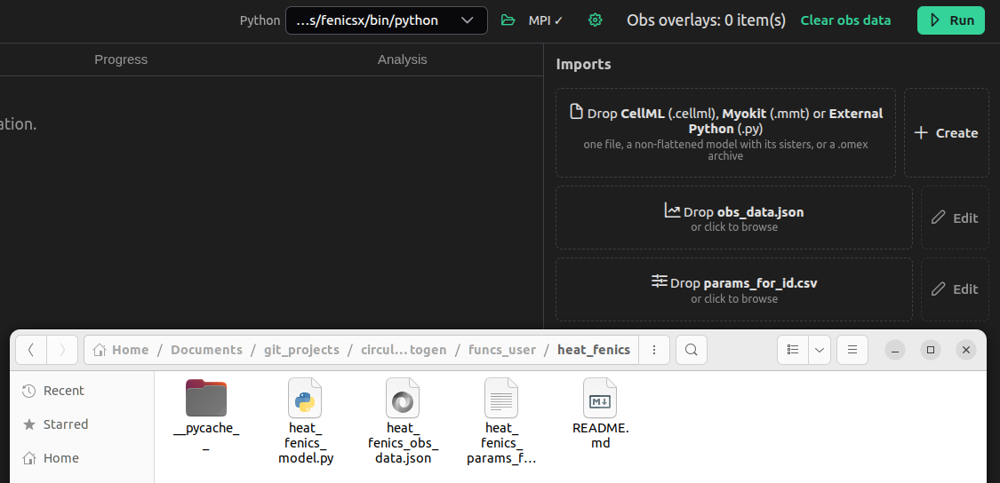
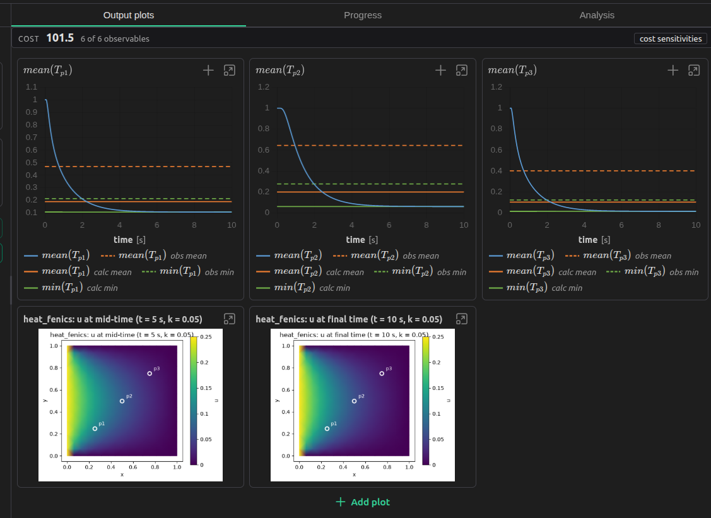
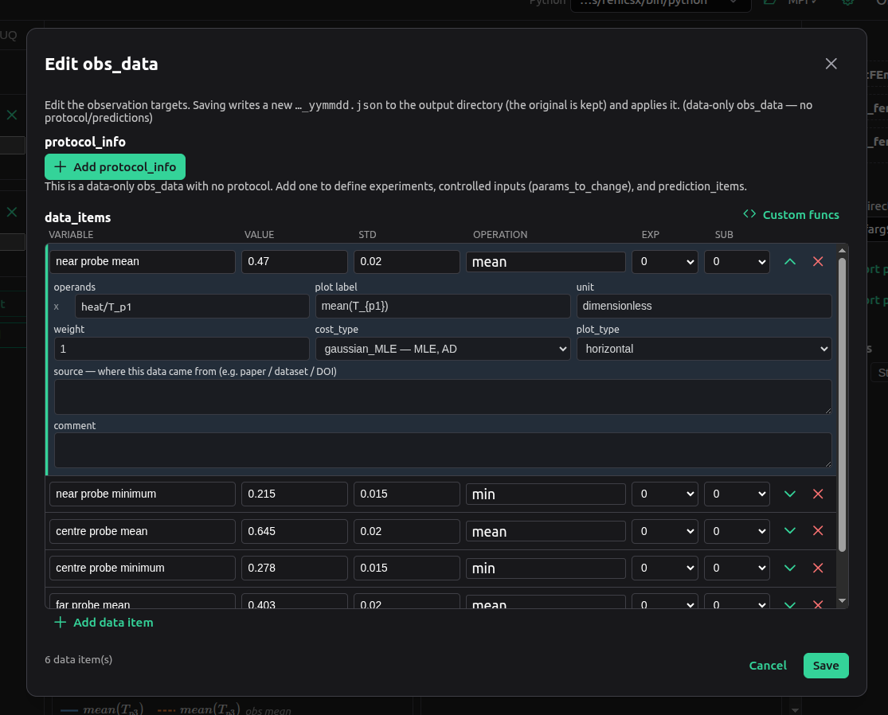
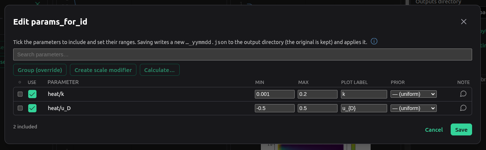
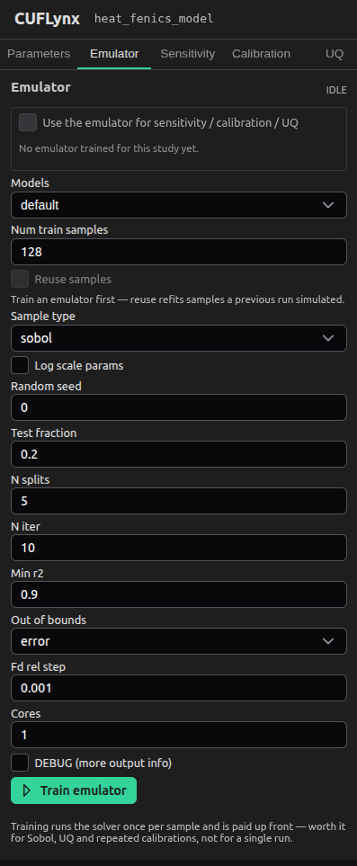

# External Python models

Everything here is optional reading — the app runs without any of it. See the
[README](../../README.md) to download and start it, and [Using CUFLynx](misc.md)
for the CellML and Myokit paths.

## What they are

CUFLynx normally takes a *model description* — a CellML file, or a Myokit `.mmt` —
and generates a solver from it. An **external python model** inverts that: you
bring the solver. It is a single `.py` file holding a class that owns its own time
stepping, and CUFLynx drives it exactly as it drives a generated model — sliders
change its parameters, plots redraw, and emulation, calibration, sensitivity and UQ all work
against it unchanged.

This is well suited for a PDE solver code (the worked example below is finite element
FEniCSx/dolfinx), a compiled library behind a thin Python binding, or a scheme
with particular time stepping.

> Not to be confused with circulatory_autogen's `python_user_defined` model type,
> where you write the RHS and CA integrates it with scipy `solve_ivp`. Here CA
> integrates nothing: it hands over `dt` / `sim_time` / `pre_time`, asks for a run,
> and reads the traces back. In CA's vocabulary this is
> `model_type: external_python` with `solver: external`.

Drop the `.py` on the model box, exactly where a `.cellml` goes. CUFLynx reads the
class's declared parameters and outputs, gives you a slider per parameter and a
plot per output, and locks **Settings → Generated model format** to
`external_python` — the file *is* the solver, so there is nothing to generate and
no other backend that could run it. Load a CellML model and the choice comes back.

## The contract

Your file declares one class and registers it at module level:

```python
class MyModel:
    parameters = {"heat/k": 0.05, "heat/u_D": 0.25}  # literal dict: name -> default
    output_names = ["heat/T_p1", "heat/T_p2", "heat/T_p3"]  # literal list

    def init_solver(self, config): ...
    def update_times(self, dt, start_time, sim_time, pre_time): ...
    def set_param_vals(self, param_dict): ...
    def run(self): ...
    def get_results(self): ...

SIM_HELPER = MyModel
```

**Every name is `component/variable`.** That is not decoration: a `params_for_id`
row addresses a parameter as `vessel_name` + `param_name`, and an obs_data operand
names an output the same qualified way. An unqualified `k` cannot be referred to by
either, so it is rejected up front rather than at your first calibration.

### Declarations

| Attribute | Rule |
|---|---|
| `parameters` | A **literal** dict of `"component/variable" -> number`. The values are the defaults: they seed the sliders and are what a parameter is reset to. |
| `output_names` | A **literal** list of `"component/variable"` names. Anything you want to plot, observe or calibrate against must be here. Empty is an error — the model would produce nothing observable. |
| `SIM_HELPER` | The class object itself, at module level. Not an instance, not the name as a string. It is an explicit registration rather than "the only class in the file", so your file is free to define helpers. |

Literal matters because CUFLynx reads both attributes **by parsing the file, not by
importing it**. That is what lets the parameter table appear the moment you drop
the `.py`, on a machine that may not even have your solver's dependencies
installed, and without running any of your code as a side effect of a drop.

### Methods

Five are required; four more are substituted for when absent.

| Method | Contract |
|---|---|
| `init_solver(self, config)` | Called **once**. Put the expensive setup here: build the mesh, compile the forms, open the library. `config` carries `dt`, `sim_time`, `pre_time`, `start_time` and `solver_info`. |
| `update_times(self, dt, start_time, sim_time, pre_time)` | Set the output grid, and nothing else. Called whenever the run window changes, so re-assembling here means paying for it on every protocol experiment. |
| `set_param_vals(self, param_dict)` | `{name: value}` for the parameters being changed. Runs on every slider drag and every calibration sample, so it must never re-initialise — keep calibratable quantities somewhere you can write in place. Raise on a name you do not know. |
| `run(self)` | Solve the whole grid, including the pre-time. **Return `False` if it diverged** (see below). Make it repeatable — reset to your initial condition at the top — because one instance is reused for thousands of samples. |
| `get_results(self)` | `{output_name: 1D numpy array}`, each of length `N + 1`, covering the whole grid **including the pre-time samples**. CA discards the leading `int(pre_time/dt)` itself; do not trim them yourself. |
| `get_init_param_vals(self, names)` *(optional)* | The declared defaults, in the order asked for. |
| `reset(self)` *(optional)* | Back to the initial condition. |
| `extra_plots(self)` *(optional)* | A list of `matplotlib.figure.Figure` objects — see below. |
| `close(self)` *(optional)* | Release resources. |

Three details do the real work:

**The grid.** `run()` produces samples at `start_time + i*dt` for `i = 0..N`, where

```
N = int(pre_time/dt) + int(sim_time/dt)
```

Use exactly that arithmetic, not your own rounding: CA uses it to size the trace,
and the two must agree exactly rather than approximately.

**`False`, not an exception.** Calibration explores parameter values that do not
work. A `False` is a sample scored as bad; an exception is a run that stops.
Return `False` for a diverged solve or non-finite output.

**`extra_plots()` is the escape hatch** for everything a time series cannot show: a
2D field, a mesh, a phase portrait over the domain. CUFLynx renders the figures to
PNG after every completed run and shows them as extra cells at the end of the
**Output plots** tab, refreshed each run. Build `Figure` objects directly rather
than going through `pyplot` — no global state and no backend to configure, which is
what keeps it safe on a headless machine.

`solver_info["user_config"]` in `init_solver`'s `config` is a free-form block passed
through untouched — a mesh resolution, a tolerance, a device. It is free-form
because what an external solver needs to be told is not something CA can enumerate,
and it is edited as JSON in **Settings → User config (JSON)**: `{"nx": 32}` on the
example below doubles the mesh resolution without touching the file.

## Installing the model's dependencies

**This is the step to get right.** CUFLynx bundles what a *CellML* model needs —
Myokit, libCellML, CasADi, numpy, scipy, pandas. It cannot bundle what *your* model
needs, and FEniCSx in particular is a conda-forge stack that no application can
carry around inside itself.

So an external python model runs in **the interpreter you pick in Settings**, and
that interpreter has to be one where `import` of your model's dependencies works.
One choice covers both tiers — the live sliders and the calibration / sensitivity /
UQ runs — so there is exactly one environment to get right.

### 1. Build the environment

For the FEniCSx example below. `fenics-dolfinx` is a **conda-forge** package: it is
not on PyPI, and it is not legacy `dolfin`.

```bash
conda create -n fenicsx -c conda-forge fenics-dolfinx python=3.11
conda activate fenicsx
pip install matplotlib numpy
```

`python=3.11` is not incidental: it is inside the `>=3.10,<3.13` window
`autoemulate` requires (step 2), so this environment can run every tab of the app.
A 3.9 or 3.13 environment would work for everything except emulation.

### 2. Add circulatory_autogen's dependencies to the same environment

That environment is also where CUFLynx's runs execute, so it needs what
circulatory_autogen imports (numpy, pandas, pyyaml, matplotlib, scipy, emcee, SALib,
nevergrad, mpi4py, tqdm, …). Installing CA itself is the easiest way to get that
list right — CUFLynx still uses the checkout you point it at, so an editable install
is the friendly option:

```bash
conda activate fenicsx
pip install -e "<CA_dir>[emulation]"
```

**Take the `[emulation]` extra.** It is what the **Emulator** tab needs, and it is
*not* part of the plain install and *not* part of `dev`: it pulls `autoemulate`, and
with it torch, gpytorch, pyro-ppl and lightgbm, plus a Python floor of 3.10 the rest
of CA does not have — which is why CA keeps it optional rather than making every
calibration carry a deep-learning stack. Without it the **Emulator** tab is flagged
as unavailable and, when opened, shows only an explanation of how to enable it — no
settings, no Train button. Everything else keeps working.

| Extra | Brings | Take it if |
|---|---|---|
| `emulation` | `autoemulate` (surrogate models) | You want the **Emulator** tab. Needs Python `>=3.10,<3.13`. |
| `uq` | `pymc` | You want the **UQ** tab's pyMC sampler. The default sampler, emcee, is a core dependency and needs nothing extra. |
| `dev` | pytest, black, flake8, mypy | You are *developing* circulatory_autogen. Not needed to use CUFLynx, and it does **not** include `emulation`. |
| `docs` | mkdocs-material, mkdocstrings | You are building CA's documentation. |

They combine (`pip install -e "<CA_dir>[dev,emulation]"`). Do **not** install any of
this into the app's own bundled environment and expect it to help: that is not where
an external python model runs.

### 3. Point CUFLynx at it

Open **Settings** (the gear icon):

- **Python** — the `fenicsx` environment's interpreter
  (`…/miniconda3/envs/fenicsx/bin/python`, or `Scripts\python.exe` on Windows).
  This is the interpreter that imports your model file. Choosing an environment
  without your dependencies is the one failure this tutorial exists to prevent: the
  error you get is your own `ImportError`, reported back through the app.
- **CA dir** — the circulatory_autogen checkout to run through, if not the default.
- **Generated model format** — nothing to do; it reads `external_python` and is
  locked, with solver `external`.

Changing the interpreter restarts the simulation worker, so the next run picks it
up, and the **Emulator** tab is re-checked against the new interpreter at the same
moment — no restart needed.

## The worked example: a FEniCSx heat equation

The flagship example ships with circulatory_autogen under
**`funcs_user/heat_fenics/`** — model, obs_data and params_for_id, with a README
covering the physics and the CA-side run. Rather than reproduce 600-odd lines here,
what follows is the same file abridged to the contract; open
`funcs_user/heat_fenics/heat_fenics_model.py` for the rest (notably a `_resolve`
shim for the handful of dolfinx calls whose names moved between 0.8.x and 0.9.x).

**What it solves.** Backward Euler for `u_t = k Δu` on the unit square, P1 Lagrange
on a 16×16 mesh: a uniformly hot plate (`u = 1` everywhere) quenched through its
boundary, with the **left edge held at the calibratable `u_D`** and the bottom, top
and right edges held at a fixed `0`. Weak form, with `u_n` the previous step:

```
∫ u v dx + dt·k ∫ ∇u·∇v dx  =  ∫ u_n v dx
```

| | Name | Meaning | Default / position |
|---|---|---|---|
| Parameter | `heat/k` | diffusivity, in the stiffness term | 0.05 (box `[0.001, 0.2]`) |
| Parameter | `heat/u_D` | Dirichlet value on the **left** edge | 0.25 (box `[-0.5, 0.5]`) |
| Output | `heat/T_p1` | probe, nearest the driven edge | (0.25, 0.25) |
| Output | `heat/T_p2` | probe, centre | (0.5, 0.5) |
| Output | `heat/T_p3` | probe, furthest | (0.75, 0.75) |

Both parameters are `fem.Constant`s already baked into the compiled form, so
`set_param_vals` is an in-place write to `.value` and never a recompilation.

Because only the left edge is driven, the three probes carry independent
information: p1 answers mostly to `u_D`, p3 mostly to `k`, and p1 must run warmer
than p3 whenever `u_D > 0` — a free correctness check on every run. (`u_D` defaults
to 0.25 rather than 0 for that reason: at `u_D = 0` every edge is identical, p1 and
p3 coincide, and the structure the example exists to show disappears.)

**Time scales.** The slowest mode decays at `λ = 2kπ² ≈ 19.7k`, so across
`k ∈ [0.001, 0.2]` the plate's time constant runs from about 51 s down to 0.25 s.
Hence `dt = 0.02` and `sim_time = 2.0`: 100 steps, about two time constants at the
default `k = 0.05`, and still milliseconds per run once the forms are compiled.
Below about `k = 0.005` the plate barely cools on this window and every observable
saturates — a sensible lower *bound*, but a flat patch of the cost surface.

**MPI.** The mesh is built on `MPI.COMM_SELF`, not `COMM_WORLD`, because CA
parallelises over *independent simulations* — each rank runs its own parameter
sample, so every rank needs a complete serial mesh.

### The contract, in situ

```python
"""A FEniCSx (dolfinx) heat-equation solver as a CUFLynx external python model."""
import numpy as np
from mpi4py import MPI
import ufl, dolfinx
from dolfinx import fem, mesh as dmesh, geometry as dgeometry
from dolfinx.fem import petsc as fem_petsc
from petsc4py import PETSc

PROBE_POINTS = ((0.25, 0.25), (0.5, 0.5), (0.75, 0.75))
INITIAL_TEMP, FIXED_TEMP, DEFAULT_NX = 1.0, 0.0, 16


class HeatFEniCSxModel:
    # Literal values only: CUFLynx reads these by parsing the file, without
    # importing it, so the parameter table appears before dolfinx is ever loaded.
    parameters = {"heat/k": 0.05, "heat/u_D": 0.25}
    output_names = ["heat/T_p1", "heat/T_p2", "heat/T_p3"]

    def init_solver(self, config):
        """Mesh, function space, forms and probe cells -- built once."""
        user_config = (config.get('solver_info') or {}).get('user_config') or {}
        nx = int(user_config.get('nx', DEFAULT_NX))
        # COMM_SELF: one complete mesh per rank -- CA parallelises over samples.
        self._mesh = dmesh.create_unit_square(MPI.COMM_SELF, nx, nx)
        self._V = fem.functionspace(self._mesh, ('Lagrange', 1))

        scalar = dolfinx.default_scalar_type
        self._k_const = fem.Constant(self._mesh, scalar(self.parameters['heat/k']))
        self._uD_const = fem.Constant(self._mesh, scalar(self.parameters['heat/u_D']))
        # dt is a Constant in the form too, so update_times is an in-place write
        # and never triggers a recompilation of the generated kernels.
        self._dt_const = fem.Constant(self._mesh, scalar(1.0))

        u, v = ufl.TrialFunction(self._V), ufl.TestFunction(self._V)
        self._u_n = fem.Function(self._V, name='u_n')
        self._uh = fem.Function(self._V, name='u')
        self._a_form = fem.form(u * v * ufl.dx + self._dt_const * self._k_const
                                * ufl.inner(ufl.grad(u), ufl.grad(v)) * ufl.dx)
        self._L_form = fem.form(self._u_n * v * ufl.dx)

        self._bcs = self._make_boundary_conditions()   # left edge u_D, rest fixed
        self._set_initial_condition()                  # uniform INITIAL_TEMP
        self._locate_probes()                          # bb_tree, once
        ...
        self.update_times(config['dt'], config.get('start_time', 0.0),
                          config['sim_time'], config.get('pre_time', 0.0))

    def update_times(self, dt, start_time, sim_time, pre_time):
        """Set the output grid. Cheap by construction: nothing is reassembled."""
        self.dt, self.start_time = float(dt), float(start_time)
        self.sim_time, self.pre_time = float(sim_time), float(pre_time)
        # CA's own arithmetic, so the two agree on the length exactly.
        self.num_steps = int(self.pre_time / dt) + int(self.sim_time / dt)
        self._dt_const.value = dolfinx.default_scalar_type(dt)
        self._times = self.start_time + dt * np.arange(self.num_steps + 1)
        self._samples = None

    def set_param_vals(self, param_dict):
        """Write new values in place. Never requires a re-init."""
        scalar = dolfinx.default_scalar_type
        for name, value in param_dict.items():
            if name == 'heat/k':
                self._k_const.value = scalar(float(value))
            elif name == 'heat/u_D':
                self._uD_const.value = scalar(float(value))
            else:
                raise ValueError(f'unknown parameter "{name}"')

    def run(self):
        """Solve the whole grid from the initial condition. Repeatable.

        Returns False rather than raising when the solve fails: calibration
        explores parameter values that do not work, and a False is a bad sample
        while an exception is a stopped run.
        """
        try:
            self._solve()          # reset(), assemble, step, record each sample
        except Exception as error:
            print(f'[heat_fenics] diverged: {type(error).__name__}: {error}')
            return False
        return all(np.all(np.isfinite(t)) for t in self._samples.values())

    def get_results(self):
        """{output_name: 1D array} of length N+1, pre_time samples included."""
        return {name: trace.copy() for name, trace in self._samples.items()}

    def extra_plots(self):
        """Two field heatmaps: mid-time and final time.

        Figure objects directly rather than pyplot: no global state and no
        backend to configure, which is what makes it safe headless.
        """
        from matplotlib.figure import Figure   # lazy: not needed to simulate
        ...                                    # tripcolor of each saved field
        return [mid_figure, final_figure]

    def reset(self): ...            # optional: back to the initial condition
    def get_init_param_vals(self, names): ...
    def close(self): ...            # optional: release the PETSc objects


#: What CUFLynx looks for when it loads this file.
SIM_HELPER = HeatFEniCSxModel
```

### Running it

1. Drop `heat_fenics_model.py` on the **model** box.
2. Check **Settings → Python** is the `fenicsx` environment. Nothing imports your
   file until the first run, so a wrong interpreter shows up as an `ImportError`
   on that run, not on the drop.
3. Set the run window: **t₁** to `2.0` in the time controls, and **Time step (dt)**
   to `0.02` in Settings — the 100 steps the model is sized for.
4. Add sliders for `heat/k` and `heat/u_D`, and drag them.

`heat/T_p1`, `heat/T_p2` and `heat/T_p3` plot as ordinary traces — they come through
the same channel a CellML model's outputs do, so overlays, added variables, unit
conversion and saved-run comparison all work here too. Below them, in the **Output
plots** tab, are the two field heatmaps from `extra_plots()`, redrawn after every
completed run: raise `heat/k` and the picture shows the plate cooling faster while
the probe traces fall in step; raise `heat/u_D` and the left edge warms while the
other three stay put.



*Dragging `heat/k` and `heat/u_D`. The traces are the model's `output_names`,
plotted through the same channel a CellML model's outputs use.*



*The `extra_plots()` figures, at the end of the Output plots tab and re-rendered
after each completed run — the view a time series cannot give you.*

## Telling CUFLynx what to fit: obs_data

`obs_data.json` is where you say **what the model is scored against**. Click
**Edit** beside the obs_data box to open the editor.

Each **data_item** is one measurement. Its row carries the fields you change most —
a name for it, the measured **value**, its **std**, the **operation**, and which
experiment/sub-experiment it belongs to — and the chevron on the right expands the
rest:

| Field | What it is |
|---|---|
| operands | Which model outputs the operation is applied to. A type-to-filter dropdown listing `time` plus your `output_names` — `heat/T_p1`, and so on. A fixed-arity operation shows how many it wants, and labels them (`x1` / `x2`). |
| operation | The reduction that turns a trace into the number being compared: `mean`, `min`, `max`, `max_minus_min`, the series comparisons, plus any user-defined func. |
| value / std | The ground truth and its uncertainty. |
| cost_type | How the mismatch is scored (`gaussian_MLE`, `MSE`, `AE`, …), plus any keyword arguments that cost func declares. |
| weight | Relative importance in the total cost. |
| unit | The unit of `value`, converted on the way in. |
| plot_type | How it is drawn: `horizontal` for a scalar of a time series, `vertical`, `series`, … |

Both the operand and the operation vocabularies are **introspected from
circulatory_autogen**, not hardcoded — including any operation or cost func you have
written yourself. What the dropdowns offer is exactly what CA can score.



*The obs_data editor. The ground truth for each observable goes in the row's
`value` and `std`; the operand picker below names which output it measures.*

**Saving** writes a dated copy (`<name>_<yymmdd>.json`) into your outputs directory —
the original is kept — and loads it immediately. The measured values then appear on
the plots as dashed reference lines, with the model's own feature drawn solid in the
same colour, and the **cost** of the current slider values is shown above the plots.
You can now tell by number, not by eye, whether a drag moved *towards* the data.

**The heat example.** The obs_data that ships with CA holds six scalars: the `mean`
and the `min` of **each** of the three probes, so every probe is scored rather than
just the centre one. Two of the six:

```json
[
  { "variable": "near probe mean",
    "name_for_plotting": "mean(T_{p1})",
    "data_type": "constant", "operation": "mean",
    "operands": ["heat/T_p1"], "unit": "dimensionless",
    "weight": 1.0, "value": 0.47, "std": 0.02,
    "cost_type": "gaussian_MLE", "plot_type": "horizontal" },
  { "variable": "near probe minimum",
    "name_for_plotting": "min(T_{p1})",
    "data_type": "constant", "operation": "min",
    "operands": ["heat/T_p1"], "unit": "dimensionless",
    "weight": 1.0, "value": 0.215, "std": 0.015,
    "cost_type": "gaussian_MLE", "plot_type": "horizontal" }
]
```

`min` is informative here because the plate cools monotonically from a uniform
start: it is the temperature the probe reaches by the end of the window, and `mean`
integrates the path it took to get there. `max` would be the initial `1.0` for every
parameter set — a constant feature contributing nothing to the cost.

## Calibrating it

From here nothing is specific to external python models — the parameters and outputs
arrived through the ordinary channels, so this is the ordinary CUFLynx workflow.



*The params_for_id editor: which parameters are calibrated, and the box the
optimiser may search in.*

**Choose what to calibrate.** Click **Edit** beside the params box and tick the
parameters, with a range each. For the example:

| vessel_name | param_name | param_type | min | max | name_for_plotting |
|---|---|---|---|---|---|
| heat | k | const | 0.001 | 0.2 | k |
| heat | u_D | const | -0.5 | 0.5 | u_{D} |

The `vessel_name`/`param_name` split is the `component/variable` name of your
declared parameter, cut at the `/` — so `heat/k` is `heat` + `k`. Every name you can
put here is one from your class's `parameters` dict.

**Run it.** The **Calibration** tab runs a genetic-algorithm parameter
identification through circulatory_autogen; **Progress** plots the cost and the
normalised parameter history live. When it finishes the best fit is written into the
sliders and re-run, so the traces and the field heatmaps you are looking at are the
fitted ones.

**Sensitivity** works the same way: Sobol indices over the parameter ranges, or a
local `d ln Y / d ln P` about the current point. With two parameters and a run in
the milliseconds a full Sobol sweep of the heat example is quick — a good way to
confirm your `set_param_vals` really is in-place before pointing the machinery at
something expensive. **UQ** gives posteriors over the same parameters, by default
with emcee; switching its **Library** to pyMC needs the `[uq]` extra in the same
environment.

**Emulator.** The **Emulator** tab trains a surrogate of the fitted scalar features
and lets sensitivity, calibration and UQ evaluate *that* instead of the model —
which is the reason to bother on a model where a single run is a finite-element
solve. Six scalar observables and two parameters make the heat example a legitimate
target. It needs the `[emulation]` extra from step 2; without it the tab is flagged
unavailable and says so rather than offering settings that cannot work.



*An emulator trained against the external model. **Train** fits it against the
solver; the tick box makes the analysis tabs use it.*

All of these run in the interpreter from **Settings → Python**, i.e. the same
environment as the live plots — which is why there is one environment to set up
rather than two.

## Exporting the study

**Export pipeline to python** writes a circulatory_autogen study you can run outside
the app, and **your `.py` travels with it**: the model file is copied into the
exported study alongside the obs_data and params_for_id, with the
`model_type: external_python` / `solver: external` configuration already set. A
study is not reproducible without the code that defines the model, and for an
external python model the code *is* the model.

**Export python plotting script** writes `plot_outputs.py`, which regenerates the
app's plots from a run's data (see
[Using CUFLynx](misc.md#replotting-a-run-outside-the-app)). It replots the traces;
the `extra_plots()` figures come from your own `extra_plots()`, which is already
portable code you can call yourself.

What the exported study does **not** carry is the environment. Whoever runs it needs
the same dependencies you installed above — so if you are handing the study to
someone else, hand them the conda line too.
